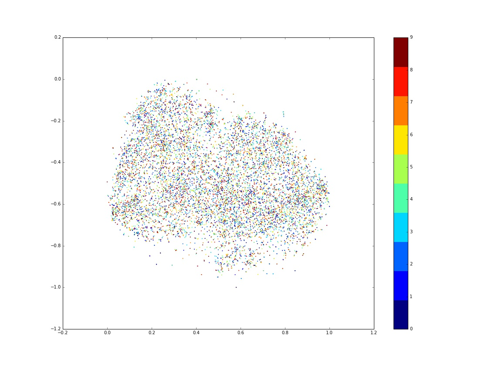
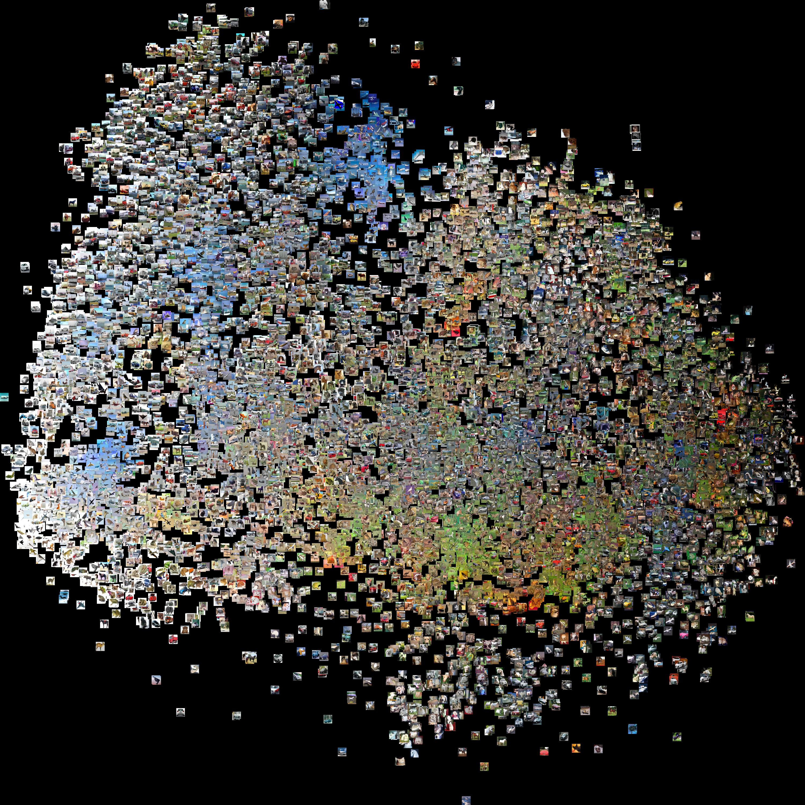
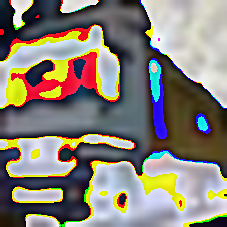
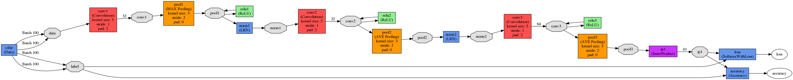
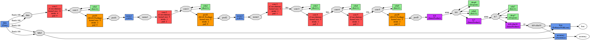
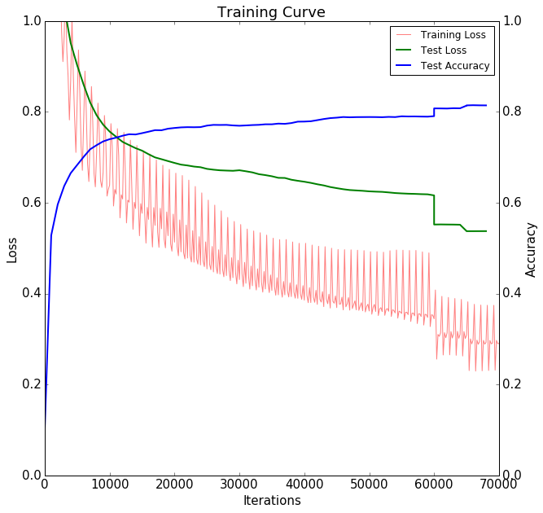
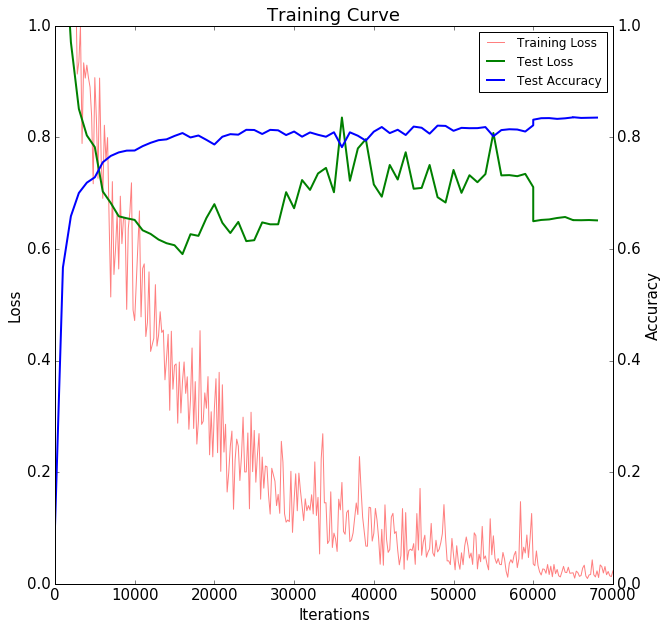
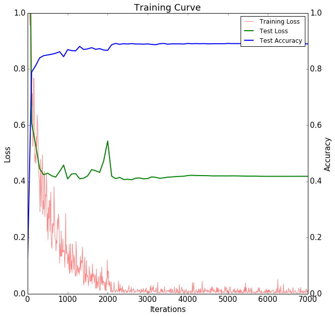
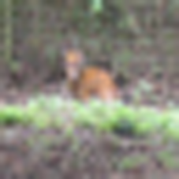

## I. Definition

### 1.1 Project Overview
#### Image Classification
Computer vision has become one of the most important fields in artificial intelligence as we have entered The Zettabyte Era, where image data is the most pervasive form of information. [Cisco]((http://www.cisco.com/c/dam/en/us/solutions/collateral/service-provider/visual-networking-index-vni/complete-white-paper-c11-481360.pdf)) predicated that the global video traffic is 70 percent in 2015 of all consumer internet traffic.

Image classification, or image recognition, is one core problem in computer vision, which is the task of assigning an input image one label from a fixed set of categories. It has a large variety of practical applications, from post number recognition, facial detection, and researches such as finding new galaxies in astronomy. Moreover, many other computer Vision tasks can be reduced to image classification, such as object detection and segmentation.

{width=320}

#### Convolutional Neural Network
Currently, the best algorithms for such tasks are based on Convolutional Neural Network. Performance of CNN on the ImageNet tests, is now close to that of humans. Its rapid development lies in the vast utilization of GPU and [large image datasets](https://en.wikipedia.org/wiki/List_of_datasets_for_machine_learning_research#Image_data). There are successful applications in image recognition, natural language processing, and playing [computer Go](https://en.wikipedia.org/wiki/Computer_Go), as well as popular frameworks such as Caffe and TensorFlow.

A convolutional neural network (CNN, or ConvNet) is a type of feed-forward artificial neural network in which the connectivity pattern between its neurons is inspired by the organization of the animal visual cortex. It mitigate the challenges posed by the simple Artificial Neural Network such as MLP by exploiting the strong spatially local correlation present in natural images. It features a 3D volumes of neurons of multiple layered structure, especially the convolutional layers with shared local filters and the pooling layers.


![Typical CNN structure [2]](./results/wikipedia_typical_cnn_structure.png){width=480}

#### Overview
In this project, we study the CNN based image classification with the famous CIFAR-10 datasets [[7]](http://www.cs.toronto.edu/~kriz/cifar.html) and Caffe framework. We show how to refine CNN with two optimized methods, the dropout and fine tuning pre-trained network, to achieve close to state-of-art accuracy.
We'll start with a more strict definition of the problems and metrics shortly, followed by section 2 the analysis of datasets and CNN algorithms. In section 3, we train the Convnet CNN, focusing on optimization methods such as dropout regularization and parameter fine tuning, and basic transfer learning. In section 4 we provide results of optimized CNN in image classification.


### 1.2 Problem Statement
The problem of image classification is straight forward, classify the given input image with the most probable category label.

#### Data
We will use CIFAR 10 datasets. It contains 10 categories of small images, 50000 for training and 10000 for testing. The images are **randomly shuffled in order** and **uniformly distributed by categories**.

##### CIFAR10 Image Examples
![CIFAR10 images from 10 categories [1]](./results/cs231n_cifar10_overview.jpg){width=720p}

##### CIFAR10 Image Summary

key | meta data
--- | ------
label_names	| [airplane, automobile, bird, cat, deer, dog, f...
num_cases_per_batch	| 10000
num_vis	| 3072
: CIFAR10 meta data

data | batch_label	| data | filenames | labels
--- | ------------------------  | ---------------------------------------------------------  | --------------------------------- | ---
0 |testing batch 1 of 1| [158, 159, 165, 166, 160, 156, 162, 159, 158, ...| domestic_cat_s_000907.png| 3
1 |testing batch 1 of 1| [235, 231, 232, 232, 232, 232, 232, 232, 232, ...| hydrofoil_s_000078.png| 8
2 |testing batch 1 of 1| [158, 158, 139, 132, 166, 182, 187, 193, 199, ...| sea_boat_s_001456.png| 8
3 |testing batch 1 of 1| [155, 167, 176, 190, 177, 166, 168, 166, 170, ...| jetliner_s_001705.png| 0
4 |testing batch 1 of 1| [65, 70, 48, 30, 23, 40, 44, 45, 45, 40, 10, 1...| green_frog_s_001658.png| 6
... |...| ...| ...| ...
9995 |testing batch 1 of 1|[76, 76, 77, 76, 75, 76, 76, 76, 76, 78, 81, 8...| cabin_cruiser_s_000783.png| 8
9996 |testing batch 1 of 1|[81, 91, 98, 106, 108, 110, 80, 84, 88, 90, 92...| tabby_cat_s_000494.png| 3
9997 |testing batch 1 of 1|[20, 19, 15, 15, 14, 13, 12, 11, 10, 9, 8, 8, ...| pekinese_s_002005.png| 5
9998 |testing batch 1 of 1|[25, 15, 23, 17, 23, 51, 74, 91, 114, 137, 90,...| convertible_s_002525.png| 1
9999 |testing batch 1 of 1|[73, 98, 99, 77, 59, 146, 214, 176, 125, 218, ...| broodmare_s_000763.png| 7
: CIFAR10 test data

#### Metrics
Two scores are used to evaluate the algorithms, accuracy and loss function.

The main reason we use accuracy is that we are mostly interested in the correctness of prediction, rather than the precision, recall, or more complicated F1 score. Moreover, this is also the most common choice of large image datasets challenges such as MNIST and ImageNet [8], which will make it easier for comparison. Error rate is also popular, but we consider it equivalent to accuracy since their summation is always 1. Finally, the accuracy can be easily integrated into Caffe at the top layer. Because of these reasons, accuracy is choosen as one of the metrics. It is defined by number of true positives divided by total number of testing samples.

$$Accuracy = \frac{N_{true\ positive}}{N_{test\ samples}}$$

Softmax loss is used in the top layer of CNN, for the convenience of its probability interpretation, namely, the category with highest probability should be the predicted label. It will enable us to better understand the prediction process of the classifier than using SVM loss or sigmoid loss.

The Softmax function is the generalization of binary Logistric function to multiple classes, it gives normalized class probabilities and can be interpreted as the probabilities of each label given the image and weights. Softmax function takes a vector of arbitrary real-valued scores in $z$ and squashes it to a vector of values between zero and one that sum to one.
$$ f_j(z) = \frac{e^{z_j}} {\sum_k e^{z_k}} $$

The full loss for the dataset is the mean of $L_i$ over all training examples together with a regularization term.
$$ L_i = -\log\left(\frac{e^{f_{y_i}}}{ \sum_j e^{f_j} }\right) $$
$f_j$ is the j-th element of the vector of class scores $f$, which is the inner product of vector and weights $f(x_i; W) = W x_i$.

#### Benchmark
For benchmark, we collect samples on CIFAR10 images classification from Sivan Sabato [8]. The human classification is reported to be 94%, the 47th best score is 79.6%, we will evaluate the performance of our final CNN model based on this range.

Accuracy | Method | Venue
---------- | ------------------------------------------------------------------ | ------------------
96.53% | [Fractional Max-Pooling](http://arxiv.org/abs/1412.6071) | arXiv 2015
94% | [Lessons learned from manually classifying CIFAR-10](http://karpathy.github.io/2011/04/27/manually-classifying-cifar10/)| unpublished 2011 |
90.68% | [Regularization of Neural Networks using DropConnect](http://cs.nyu.edu/~wanli/dropc/) |	ICML 2013
89% | [ImageNet Classification with Deep Convolutional Neural Networks](http://papers.nips.cc/paper/4824-imagenet-classification-with-deep-convolutional-neural-networks) | NIPS 2012
79.6%	| [An Analysis of Single-Layer Networks in Unsupervised Feature Learning](An Analysis of Single-Layer Networks in Unsupervised Feature Learning) | AISTATS 2011
: Part of CIFAR10 datasets classification best scores

## II. Analysis
In this section, we investigate the datasets, CNN algorithms and Caffe framework that we are going to use.

### 2.1 Data
#### Exploration
Each image in CIFAR 10 is a `32px x 32px` RGB image, with one label to be classified. Such small image size implies that it's prone to overfitting, which means that small number of CNN parameters and strong regularization may be needed for better performance.

#### Visualization
To gain a better view of possible patterns in the datasets, we performed a PCA feature extraction, and plotted the 2-D feature map of the 1000 images in datasets. The labels from 0 to 9 corresponds to names `['airplane', 'automobile', 'bird', 'cat', 'deer', 'dog', 'frog', 'horse', 'ship', 'truck']` in order. The axises are reduced 2-D features generated by PCA codes.

Describing the similarity of images with only two features is a none-trivial task, yet 2-D visualization with PCA helps us to gain an overview on the patterns inside the datasets. Although in large scale the datasets seem to be random, small clusters can be observed for each label, which implies images of this category do share some common features. We can expect more pattern be captured in higher dimensional feature space with CNN.

{width=480}


We can use a visualization technique called [t-SNE](https://lvdmaaten.github.io/tsne/) to take the CIFAR-10 images and embed them in two dimensions so that their local pairwise distances are best preserved, namely the nearby images share more similar features. The clustering becomes more obvious as we can see pictures forming heat map like zones and even overlapping with each other.

{width=320}

#### Test run on linear classifier
For introduction, we first implement simple linear classifier using `sklearn`, and run it on test datasets.
[SGFClasifier](http://scikit-learn.org/stable/modules/generated/sklearn.linear_model.SGDClassifier.html#sklearn.linear_model.SGDClassifier) is a regularized linear models with stochastic gradient descent (SGD) learning with linear SVM loss function. After training the whole datasets, we get a test accuracy of 21%. It can be shown that linear classifier, although simple and fast, can not capture most of the patterns in image features, and fails most classification tasks.


### 2.2 Algorithms and Techniques

#### Multilayer Perceptron
We first introduce the Multilayer Perceptron (MLP), a basic neural network that consists of only fully connected layers and between input and output.
MLP models does not take into account the spatial structure of data, and the large number of parameters quickly leads to overfitting. For images with high-dimensional inputs, it is impractical to connect neurons to all neurons in the previous volume because such a network architecture does not take the spatial structure of the data into account.

![A Neural Network with 2 hidden layers [1]](./results/cs231n_neural_network_structure.jpg){width=320}


#### Convolutional Neural Network
A CNN architecture is formed by a stack of distinct layers that transform the input volume into an output volume through a differentiable function. A few distinct types of layers are commonly used.

##### Convolutional Layer
The convolutional layer is the core building block of a CNN. The layer's parameters consist of a set of learnable filters or kernels. Stacking the activation maps for all filters along the depth dimension forms the full output volume of the convolution layer. Every entry in the output volume can thus also be interpreted as an output of a neuron that looks at a small region in the input and shares parameters with neurons in the same activation map.

Convolutional networks exploit spatially local correlation by enforcing a local connectivity pattern between neurons of adjacent layers: each neuron is connected to only a small region of the input volume. Such an architecture ensures that the learnt filters produce the strongest response to a spatially local input pattern.

Parameter sharing scheme is used in convolutional layers to control the number of free parameters. It relies on one reasonable assumption: if one patch feature is useful to compute at some spatial position, then it should also be useful to compute at a different position. Therefore, it is common to refer to the sets of weights as a filter (or a kernel), which is convolved with the input. The result of this convolution is an activation map, and the set of activation maps for each different filter are stacked together along the depth dimension to produce the output volume.

![LeNet CNN structure [6]](./results/LeNet CNN structure.png){width=480}


##### Pooling Layer
Another important concept of CNNs is pooling, which is a form of non-linear down-sampling. The function of the pooling layer is to progressively reduce the spatial size of the representation to reduce the amount of parameters and computation in the network, and hence to also control overfitting.

The pooling layer operates independently on every depth slice of the input and resizes it spatially. The most common form is a pooling layer with filters of size 2x2 applied with a stride of 2 max pooling. Every MAX operation would in this case be taking a max over 4 numbers, discarding 75% of the data.

##### ReLU Layer
ReLU is the abbreviation of Rectified Linear Units. This is a layer of neurons that applies the non-saturating activation function `f(x)=max(0, x)`. It increases the nonlinear properties of the decision function and of the overall network without affecting the receptive fields of the convolution layer.

##### Fully Connected Layer
After several convolutional and max pooling layers, the high-level reasoning in the neural network is done via fully connected layers. Neurons in a fully connected layer have full connections to all activations in the previous layer, as seen in regular Neural Networks. Their activations can hence be computed with a matrix multiplication followed by a bias offset.

#### Dropout Layer
Dropout is an extremely effective, simple and recently introduced regularization technique that complements the other methods (L1, L2, maxnorm) [4]. While training, dropout is implemented by only keeping a neuron active with some probability, or setting it to zero otherwise.

##### Loss Layer
The loss layer specifies how the network training penalizes the deviation between the predicted and true labels and is normally the last layer in the network. In our study, softmax loss is used for predicting a single class of K mutually exclusive classes.

![Dropout Neural Net Model [4]](./results/Dropout Neural Net Model.png){width=320}


#### Caffe
Caffe is a deep learning framework made with expression, speed, and modularity in mind.[[Caffe]](http://caffe.berkeleyvision.org/) It features easy defining nets, high speed GPU computation, and lots of open source community support such as shared models.

##### Defining Layers
Caffe defines a net layer-by-layer in its own model schema. The network defines the entire model bottom-to-top from input data to loss. As data and derivatives flow through the network in the forward and backward passes Caffe stores, communicates, and manipulates the information as blobs: the blob is the standard array and unified memory interface for the framework. The layer comes next as the foundation of both model and computation. The net follows as the collection and connection of layers.
To create a Caffe model we need to define the model architecture in a protocol buffer definition file (prototxt). The layers we will use are Convolution, Polling, Softmax, ReLU, Inner Product (Fully Connected) and Dropout layers.

##### Defining Solvers
The solver orchestrates model optimization by coordinating the network’s forward inference and backward gradients to form parameter updates that attempt to improve the loss. The responsibilities of learning are divided between the Solver for overseeing the optimization and generating parameter updates and the Net for yielding loss and gradients.
We will use the default solver Stochastic Gradient Descent, tuning the hyperparameters learning policy and related parameters.

##### Defining Models
The models are defined in plaintext protocol buffer schema (`prototxt`) while the learned models are serialized as binary protocol buffer `.caffemodel` files following Google Protocol Buffer. It enables us to directly load and fine tune a pre-trained CNN, which will greatly reduce the training cost and improve efficiency.
We will use the [Caffenet](https://github.com/BVLC/caffe/tree/master/models/bvlc_reference_caffenet) model comes with [Caffe Model Zoo](https://github.com/BVLC/caffe/wiki/Model-Zoo) framework of Caffe.

#### Environment
The study of this problem is performed on a Ubuntu 14.04 GPU instance of AWS EC2, with NVIDIA CUDA 7.5 and Caffe.

## III. Methodology
In this section, we show the process of training CNN with Caffe. We'll highlight how to improve CNN performance with two optimized methods, namely the dropout and fine tuning pre-trained network.

### 3.1 Data Preprocessing
To improve the performance of file IO and memory access, Caffe load data from database and compute data in binary blobs. We will need to convert pickled CIFAR10 python batch to `leveldb`.

It's important to center the images by mean subtraction, which will be handled by Caffe scripts.

For fine tuning the Caffenet, we will need to resize CIFAR10 `32*32` image to `227*227` images, then convert and save them to database.

----------------------------------------------------- ---------------------------------------------------------- --------------------------------------------------------------------
{width=30%}   {width=30%}  {width=30%}
             CIFAR10 mean image                                      CIFAR10 image "truck"                                                    CIFAR10 image "truck" centered
----------------------------------------------------- ---------------------------------------------------------- --------------------------------------------------------------------

: CIFAR10 data mean subtraction


Caffe data augmentation can be performed on the fly automatically in data layer. However, this method is not used as its improvement to CIFAR 10 should be small due to its small amount of features and labels.


### 3.2 Implementation
With Caffe's powerful framework, we can define and train CNN by writing network and solver `.prototxt` files. Most of challenges lie in matching the layered structures and their dimensions.

#### Convnet
We will start with [Caffe implementation](http://caffe.berkeleyvision.org/gathered/examples/cifar10.html) of Alex Krizhevsky’s cuda-convnet.

- Network structure
``` text
cifar10_full_train_test.prototxt
--------------------------------------------------------------------------------
cifar    Data                                             -> data, label
cifar    Data                                             -> data, label
conv1    Convolution     (, x2.0)              data       -> conv1       5+2 32
pool1    Pooling                               conv1      -> pool1       3/2
relu1    ReLU                                  pool1      -> pool1
norm1    LRN                                   pool1      -> norm1
conv2    Convolution     (, x2.0)              norm1      -> conv2       5+2 32
relu2    ReLU                                  conv2      -> conv2
pool2    Pooling                               conv2      -> pool2       3/2
norm2    LRN                                   pool2      -> norm2
conv3    Convolution                           norm2      -> conv3       5+2 64
relu3    ReLU                                  conv3      -> conv3
pool3    Pooling                               conv3      -> pool3       3/2
ip1      InnerProduct    (Dx250.0, x2.0 Dx0.0) pool3      -> ip1
accuracy Accuracy                              ip1, label -> accuracy
loss     SoftmaxWithLoss                       ip1, label -> loss
```

{width=640}

- Network solver
``` shell
net: "examples/cifar10/cifar10_full_train_test.prototxt"
test_iter: 100
test_interval: 1000       # Carry out testing every 1000 training iterations
base_lr: 0.001            # The base learning rate, momentum and the weight decay of the network.
momentum: 0.9
weight_decay: 0.004
lr_policy: "multistep"    # step learning policy returns base_lr*gamma^(floor(iter/step))
gamma: 0.1
stepvalue: 60000
stepvalue: 65000
display: 200              # Display every 200 iterations
max_iter: 70000           # The maximum number of iterations
snapshot: 10000           # snapshot intermediate results
snapshot_format: HDF5
snapshot_prefix: "examples/cifar10/cifar10_full"
solver_mode: GPU
```

- Network hyperparameters
For ConvNet, the main hyperparameters to be tuned are within the first three convolution layers. After test runs on three different learning policies fixed, step, and multistep, the original strategy of ConvNet seems to be the best one. So we will keep the multistep policy, and let the learning rate decrease by factor of 0.1 at 60k and 65k steps.

#### CNN With Dropout
For brevity, we will describe the difference of CNN with dropout and fine tuning Caffenet with the original ConvNet, other details can be found in their prototxt files.
For CNN with dropout, we will add two more FC layers after the FC layer in Convnet, each of them is followed by a ReLU activation layer and dropout layer.
To utilize the strong regularation of the dropout layers, we increase the depth (`num_output`) of Conv layers and FC layers to enable the net to capture more features and patterns.

The ConvNet with dropout share the same convolution layers as ConvNet, so we will keep the learning policy unchanged.

{width=640}

#### Caffenet Fine Tuning
To fine tune pre-trained Caffenet, we will modify its net strucutre and solver.
For CNN net prototxt, the name of last FC layer is changed to avoid using Caffenet weights, its output depth is set to the number of CIFAR labels. The database sources are modified accordingly.
For solver protoxt, we load the weights of Caffenet model, and decrease its base learning rate as the pre-trained model should already have good performance on new datasets.
We also make some compromises due to computation limitation, for example, using a subset of CIFAR10 (10k training images, 2k testing images), smaller data batch size and less training iteration. The original CIFAR10 datasets have 60k images of ~200MB space and memory, while 12k resized CIFAR10 for CaffeNet take ~3GB space and memory, which is stressful to run on a GPU instance with 4GB vRAM.

{width=640}

## IV. Results
In this section, we study the results of three CNN models that we have trained.

### 4.1 Model Evaluation
Original Convnet is straightforward and works pretty well for CIFAR10 with small image size. However, the tuning of the multisteps learning rate is effective yet difficult.
The learning curves are smooth, with test accuracy continously increasing, training loss and testing loss decreasing. It means that there's no overfitting problem. Also the gap of two loss curves is not obvious, implies that the variance is small and the network is robost.

{width=320}

By adding simple dropout layers and more depth to data blobs, CNN with dropout gains ability to capture more patterns with overfitting restricted by extra regularization.
Due to the probabilistic regularization brought by dropout, during the trainging, the loss curve of test data experiences large variance. However, the algorithm mangages to overcome this issue once the learning rate deceases by factor of 10 at iteration 60000.

{width=320}

Using fine-tuned Caffenet and the pre-trained weights, we achieve good scores of accuracy at the initial and final steps of training. It shows most of the patterns in different images can be captured using the same network.
Fine-tuned Caffenet has strengths of both previous CNNs, without sign overfitting or variance. It gives higher accuracy and lower losses variance in 1/10 of the same iteration steps.

{width=320}


### 4.2 Justification
The three CNNs give successful results for CIFAR10 image classification, with final testing accuracy scores of 81% to 83.55% and 89%.
We also show how the improvement of CNN with dropout and fine-tuning pre-trained CNN. Our best result, the fine tuning pre-trained CaffeNet, has close to the state-of-art accuracy compared with benchmark, with much less effort in computation.
Thus we have shown that the study clearly demonstrate how to design, train, and improve CNN for CIFAR10 image classification task.

Accuracy | Method | Venue
---------- | ------------------------------------------------------------ | ------------------------
96.53% | [Fractional Max-Pooling](http://arxiv.org/abs/1412.6071) | arXiv 2015
94% | [Lessons learned from manually classifying CIFAR-10](http://karpathy.github.io/2011/04/27/manually-classifying-cifar10/)| unpublished 2011 |
90.68% | [Regularization of Neural Networks using DropConnect](http://cs.nyu.edu/~wanli/dropc/) |	ICML 2013
89% | [ImageNet Classification with Deep Convolutional Neural Networks](http://papers.nips.cc/paper/4824-imagenet-classification-with-deep-convolutional-neural-networks) | NIPS 2012
89% | Fine tuning Caffenet | MLND Capstone 2016
83.55% | CNN with dropout | MLND Capstone 2016
81% | ConvNet | Capstone 2016
79.6%	| [An Analysis of Single-Layer Networks in Unsupervised Feature Learning](An Analysis of Single-Layer Networks in Unsupervised Feature Learning) | AISTATS 2011
: Accuracy comparison with benchmark

## V. Conclusion
We have shown how to train CNN for image classification tasks, moreover, how to refine CNN models by dropout layers and fine tuning pre-trained models. Our training accuracy improves from 81% to 83.55% and 89%, giving good performance for CIFAR 10 datasets.

There are two challenges during the project, the complication nature of CNN and the high demand of CNN training in computing power and time. The optimization of CNN hyperparameters are hard due to large number of parameters and difficulty in interpretation of their mechanism. The cost of CNN training is high for large datasets, it usually takes hours running on latest GPUs. Using cloud computing may help to alleviate the long training circle.
Despite the challenges, image classification with CNN is promising for the rapid development in hardware, software, and industry applications. Thus future work on these tasks are attracting, such as performing transferred learning on general datasets, and migrating CNN on cloud platform such as TensorFlow.

### 5.1 Free-Form Visualization
We will load the fine-tuning CaffeNet and use it to detect CIFAR10 images and unseen images (see supplementary notebook).
By changing the last layer of CaffeNet from loss layer to Softmax classifier, we will have the network for inference deployment. Combined by the weights saved as snapshot during training, it has good accuracy as expected. The following are some typical images and results.

1. Good prediction: for picture representing the label nicely, CNN is confident about the result with probability ~99%.
2. Positive prediction: CNN gives right prediction but the probability is in range [0.6, 0.9], especially when the picture is vague.
3. False prediction: it seems that CNN fail to capture the pattern deer and believes that it's a bird due to some local similarity.
4. Underfitting: CNN can't tell the difference between a SUV and truck, but seems to know it's a vehicle, which may be improved by using more training samples.

----------------------------------------------------------------- ----------------------------------------------------------------------
{width=50%}    {width=50%}

True label: ship                                                  True label: cat

predication  probability                                          predication  probability

ship	       9.999993e-01                                         cat	         0.709629

automobile   6.906423e-07                                         dog          0.115369

airplane	   5.492342e-08                                         truck        0.115369

{width=50%}   {width=50%}

True label: deer                                                  True label: automobile

predication  probability                                          predication  probability

bird	0.995539                                                    truck	      6.391540e-01

frog	0.001864                                                    automobile	3.589041e-01

deer	0.001414                                                    frog	      1.013666e-03
----------------------------------------------------------------- ----------------------------------------------------------------------

: CaffeNet prediction on CIFAR10 with top probabilities


### 5.2 Reflection
We have showed how to train CNN for CIFAR image classification task in Caffe, and how to improve it with dropout and fine-tuning pre-trained CNN. We summarize the steps as following.

1. Design CNN structure and solver.
2. Preprocess images based on the needs of CNN and Caffe.
3. Train CNN.
4. Plot learning curves, analyze results.
5. Refine hyperparameters such as learning policy, learning rate.
6. Modify CNN structure by adding dropout layers, or loading pre-trained models.
7. Repeat step 3-6 until performance is satisfactory.

### 5.3 Improvement
Due to limitation of time and computing resources, some of the improvement methods are left out for future study.

1. Fine tuning learning rate and policy, which has been shown by the ConvNet results.
2. Fine tuning dropout layers depths and dropout rate, hopefully we can get a CNN with dropout that has even better accuracy and less variance.
3. More experiments on transfer learning of CIFAR10, including trying different models, and more training iterations and fine-tuning of hyperparameters.

## Reference
[1]: [CS231n Convolutional Neural Networks for Visual Recognition
](http://cs231n.github.io/)

[2]: [Wikipedia: Convolutional neural network](https://en.wikipedia.org/wiki/Convolutional_neural_network)

[3]: [ConvNet by Alex Krizhevsky](https://code.google.com/p/cuda-convnet/)

[4]: [Dropout: A Simple Way to Prevent Neural Networks from Overfitting](http://www.cs.toronto.edu/~rsalakhu/papers/srivastava14a.pdf)

[5]: [AlexNet: ImageNet Classification with Deep Convolutional Neural Networks](http://papers.nips.cc/paper/4824-imagenet-classification-with-deep-convolutional-neural-networks)

[6]: [Y. LeCun, L. Bottou, Y. Bengio, and P. Haffner. Gradient-based learning applied to document recognition](http://yann.lecun.com/exdb/publis/pdf/lecun-01a.pdf)

[7]: [CIFAR10: Learning Multiple Layers of Features from Tiny Images, Alex Krizhevsky, 2009](http://www.cs.toronto.edu/~kriz/learning-features-2009-TR.pdf)

[8]: [Sivan Sabato: Classification datasets results](http://rodrigob.github.io/are_we_there_yet/build/classification_datasets_results.html)
